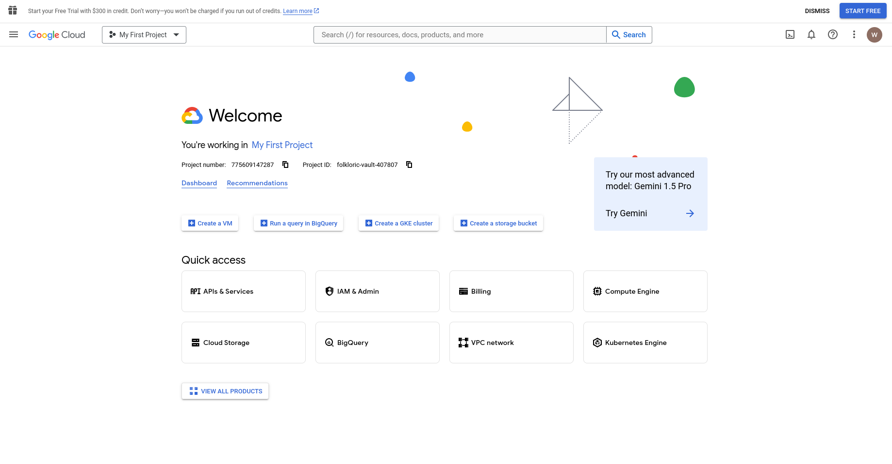
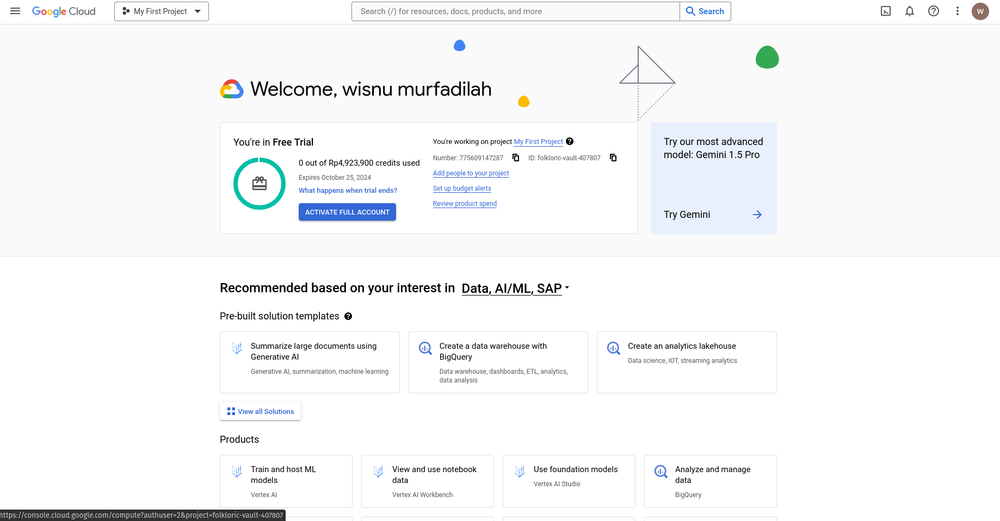

# GCP Repo
## Register the Free Tier

Registrasi seperti biasa, kebetulan saya sudah punya akun yg belum teregistrasi free tier, Klik tombol `Start Free Tier` lalu mengisi data registrasi seperti nama, alamat, identitas (NIK), card information, dsb untuk mendapatkan akun free tier anda

## What is Google Cloud Platform (GCP)
GCP adalah penyedia *cloud computing* oleh google untuk umum / *end user*. GCP ini menggunakan infrastruktur yang sama untuk menjalankan aplikasi google lainnya seperti gmail, youtube, dll. 

Mirip seperti AWS, GCP juga memiliki berbagai *service* seperti *computing, storage, networking, machine learning, etc*. 

## Compare AWS dan GCP
Karena AWS dan GCP ini memiliki service yang kurang lebih mirip, kita bisa bandingkan beberapa service umum dari kedua platform ini

### Computing Service
Sesuai namanya *computing service* ini adalah service yang ditawarkan umumnya untuk melakukan *computing* seperti hosting website, atau menjalankan aplikasi kita di *cloud* tanpa perlu kita pikirkan *setup* infrastrukturnya.
**GCP** : Google App Engine, Google Compute Engine, Google Kubernetes Engine.
**AWS** : EC2, Lambda.

### Storage
GCP dan AWS sama - sama memberikan service untuk *storage* dengan cukup beragam seperti
**GCP** : Cloud SQL, Cloud Spanner, Cloud Storage.
**AWS** : Amazon S3, Amazon Glacier, EBS.

Banyak yang mengatakan bahwa untuk storage ini, GCP lebih baik jika penggunaanya berhubungan dengan AI / Big data karena ada fitur yang membantu pengolahan data besar bernama **BigQuery**

Sebenarnya masih banyak service lain seperti networking, database, dan security yang ditawarkan oleh kedua platform ini, tetapi kurang lebih memiliki kesamaan untuk penggunaan dan tujuannya, sehingga tidak saya bahas lebih jauh.

### Price compare

**GCP** biasanya menawarkan billing per menit, dan biasanya memiliki pembayaran dimuka untuk *service* yang akan digunakan itu selama 1 bulan penggunaan.

**AWS** menawarkan *pay as you go* yang biayanya bisa kecil atau besar tergantung dari *service* yang digunakan.

Kedua platform bisa dibilang memiliki kelebihan dan kekurangan masing - masing, tergantung sebagai user akan memilih platform yang paling cocok untuk aplikasi yang akan dijalankan. Saya sendiri merasa penggunaan AWS ini ditunjukan untuk orang - orang yang belajar *cloud computing* karena penggunaannya yang bisa dibilang mudah, serta banyak sekali service - service yang sudah ter integrasi dalam platform AWS ini, sedangkan untuk orang yang lebih *advance* dan mungkin berkecimpung dalam dunia AI, GCP lebih baik dipilih karena *cost* yang digunakan untuk big data lebih murah, serta beberapa fitur yang membantu user dalam mengoprasikan aplikasinya.

